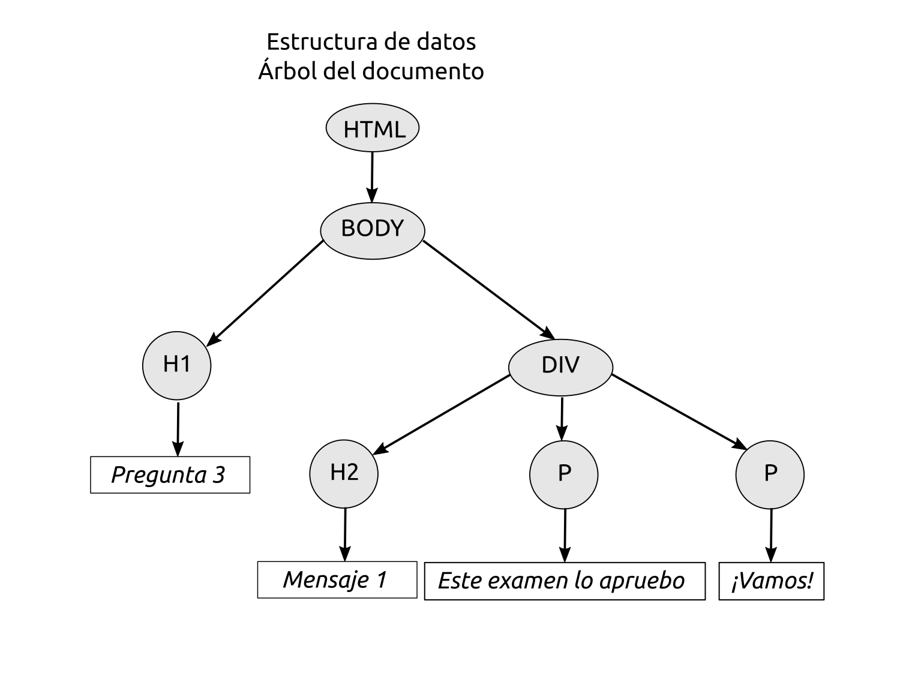

 

# Examen Parcial: 2021-04-13

* **Tiempo**: 2h 
* **Descripción**: Examen parcial de LTAW
* **Fecha**: 2021/Abril/13
* **Formato**: Presencial. Realizado a través de Aula virtual (sin internet)
* **Puntuación**: Todas las preguntas valen 0.5. Las preguntas incorrectas No restan
* **Temario**: Entra todo lo visto tanto en teoría como en práctica hasta el momento:
  * Teoría: S1-S6
  * Práctica: L1-L8

# Enunciado

## Pregunta 1. HTML y peticiones

El siguiente código HTML está alojado en el fichero index.html en un servidor web. Desde elnavegador introducimos la url raiz del servidor. Indica qué ficheros solicita el navegador al servidor y en qué orden

```html
<!DOCTYPE html>
<html>
<head>
    <meta charset="UTF-8">
    <meta http-equiv="X-UA-Compatible" content="IE=edge">
    <meta name="viewport" content="width=device-width, initial-scale=1.0">
    <title>Document</title>
    <script src="Ej.js"></script>  
    <link rel="stylesheet" href="style.css">
    <!-- Download: file.pdf 
    -->
</head>
<body>
    
    <a href="link.html">Link</a>
    <p id="image2.jpg">Image 2</p>
    <!-- 
        Load: image3.jpg
     -->
     <p>Image 3</p>
</body>
</html>
```

### Solución

En total se solicituan 4 ficheros, en este orden: 1. P1.html, 2. Ej.js, 3. style.css y 4.image.jpg

**Explicación extendida** (Es una explicación adicional para entender la solución, esto no tienes que ponerlo como parte de la solución en el examen): Al introducir la url en el navegador, éste hace una petición http al servidor, solicitando el documento raiz. El servidor devuelve **index.html**. El navegador abre este fichero html y lo va analizando **secuencialmente**. Al llegar a la etiqueta **script**: hace una petición al servidor del fichero **Ej.js**. Al llegar a la etiqueta **link** hace la solicitud del fichero **style.css**

Dentro del cuerpo, necesita renderizar la imgen **image.jpg**, por lo que hace otra petición al servidor. Las siguientes líneas de código HTML NO hacen que el navegador haga más peticiones. Una es un enlace: hasta que el usuario no pulse en el enlace no se hace la petición. La otra es un párrafo identificado con el nombre *image2.jpg*. Tu puedes identificar los párrafos con el nombre que quieras. 

Hay nombres de ficheros en los comentarios. Esto no hace nada: son comentarios. Los ha puesto el desarrollador para indicar algo, pero el navegador los ignora

## Pregunta 2: S1. Tecnologias web

Enumera cuál son las tecnologías web más importantes en el lado del cliente

### Solución

HTML, CSS y Javascript

**Explicación extendida**: El HTML nos sirve para dar estructura, el CSS para dar estilo y Javascript para realizar acciones

## Pregunta 3: S1. HTML y estructura

El siguiente árbol representa la estructura en memoria de un documento HTML que no tiene cabeza (sólo tiene cuerpo). Escribe el código HTML que da lugar a esta estructura



### Solución

```html
<!DOCTYPE html>
<html>
    <body>
        <h1>Pregunta 3</h1>
        <div>
            <h2>Mensaje 2</h2>
            <p>Este examen lo apruebo</p>
            <p>¡Vamos!</p>
        </div>
    </body>
</html>
```


## Pregunta 4: S2. HTML

Escribe el código HTML que produce esta salida en el navegador. El documento debe estar completo, pero sin incluir la cabeza. No hay estilo definido, sólo HTML


### Solución

```html
<!DOCTYPE html>
<html>
<body>
    <h1>Encabezado grande</h1>
    <h2>Encabezado del siguiente nivel</h2>
    <h3>Encabezado del siguiente nivel</h3>
    <p>Esto es un párrafo</p>
    <h3>Listas no ordenadas</h3>
    <p>Ejemplo de lista no ordenada</p>
    <ul>
        <li>Elemento A</li>
        <li>Elemento B</li>
        <li>Elemento C</li>
    </ul>
</body>
</html>
```

## Pregunta 5: S2. HTML y etiquetas

Explica para qué se usan las etiquetas `<div></div>`

### Solución

Estas etiquetas nos permiten crear contenedores genéricos para estructura mejor nuestros documentos HTML. Dentro de ellas podemos incluir cualquier otro elemento, incluido otras etiquetas div

## Pregunt 6: S2. HTML y elementos

Escribe el **cuerpo** de un documento html en el que haya **3 párrafos** con los textos: párrafo 1, párrafo 2 y párrafo 3. El párrafo 1 está identificado con la cadena "p1". Los párrafos 2 y 3 pertenecen al mismo grupo, identificado como "A". Escribe **sólo el cuerpo**, delimitado por sus etiquetas correspondientes


### Solución

```html
<body>
    <p id="p1">Párrafo 1</p>
    <p class="A">Párrafo 2</p>
    <p class="A">Párrafo 3</p>
</body>
```

## Pregunta 7: S3. Selectores

Explica la función de un selector en CSS, y pon un ejemplo sencillo aplicado a todos los párrafos (usando la propiedad color)

### Solución

Los selectores nos permiten seleccionar elementos HTML sobre los que aplicar un conjunto de propiedades. Por ejemplo, si queremos que todos los párrafos de un documento tengan el color rojo, el selector a usar sería este:

```css
p {
    color: red;
}
```


## Pregunta 8: S3. Selectores y HTML

Cuando queremos dar estilo a elementos de HTML, dónde podemos colocar los **selectores**

### Solución

Los selectores se pueden incluir dentro del propio documento HTML, delimitados por las etiquetas <style></style> o bien en un fichero CSS externo

## Pregunta 9: S3. Reglas de estilo

Dado el siguiente código HTML:

```html
<!DOCTYPE html>
<html>
  <head>
    <meta charset="utf-8">
    <meta http-equiv="X-UA-Compatible" content="IE=edge">
    <meta name="viewport" content="width=device-width, initial-scale=1.0">
    <title>Pregunta 9</title>
    <link rel="stylesheet" href="Ej-02.css">
  </head>

  <body>
    <div>
      <p style="color:red;">P1</p>
      <p id="quien">P2</p>
      <p class="cual">P3</p>
      <p>P4</p>
    </div>
  </body>
</html>
```

Se le aplica la siguiente hoja de estilo:

```css
#quien {
  color: orange;
}

.cual {
  color: green;
}

/* Regla de estilo 1 */
p {
  color: blue;
}

/* Regla de estilo 2 */
div {
  color: yellow;
}

body {
  color: pink;
}
```

Determinar de qué color se renderizarán los textos P1, P2, P3 y P4

### Solución

* P1: Rojo
* P2: Naranja
* P3: Verde
* P4: Azul

## Pregunta 10: S3. Prioridades

Si en la hoja de estilo de la pregunta 9 se eliminan las reglas de estilo 1 y 2 (las indicadas en los comentarios), ¿De qué colo se renderizarán ahora los texot P1, P2, P3 y P4?

* P1: Rojo
* P2: Naranja
* P3: Verde
* P4: Rosa

## Pregunta 11. S3. Modelo de Caja

Explica qué es el modelo de cajas y de qué partes está formado

### Solución

Todos los elementos HTML se tratan como cajas, a la hora de renderizarlos. Cada caja tiene  4 partes: el contenido, el relleno (padding), el borde y el margen

## Pregunta 12. S4. Usos de Javascript

Los programas javascript, ¿Dónde los podemos ejecutar en general? (usos de javascript)

### Solución

Los programas javascript se pueden ejecutar tanto en el cliente (navegador) como en el servidor

## Pregunta 13. S4. Javascript y HTML

¿Dónde se escribe el código javascript asociado a un fichero HTML?

### Solución

El código javascript se puede situar en tres lugares diferentes:

1. Dentro del fichero html, en las propias etiquetas HTML
2. Dentro del fichero html, situando el código delimitado por las  etiquetas <script></script>
3. En un fichero externo javascript, que cargamos desde el documento html con el atributo **src** de la etiqueta `<script>`

## Pregunta 14. S4. Atributo defer

Explica para qué se usa el atributo defer dentro de la etiqueta `<script>`

### Solución

Cuando se coloca este atributo el programa javascript se empieza a ejecutar una vez que el navegador ha terminado de procesador el fichero html

## Pregunta 15. S4. Acceso a elementos HTML

Dado el siguiente código html:

```html
<!DOCTYPE html>
<html lang="en">
<head>
    <meta charset="UTF-8">
    <meta http-equiv="X-UA-Compatible" content="IE=edge">
    <meta name="viewport" content="width=device-width, initial-scale=1.0">
    <title>Pregunta 15</title>
    <script src="P15.js" defer></script>
</head>
<body>
    <h1>Pregunta 15</h1>
    <h2 class="A"></h2>
    <p class="A"></p>
</body>
</html>
```

Y el siguiente código Javascript:

```js
const d = document.getElementsByClassName("A");

for (let e of d) {
    e.innerHTML="Hola";
}
```

Indica qué texto aparece en la página web

### Solución

Aparecerán tres líneas, con los siguientes textos:

* Pregunta 15
* Hola
* Hola

### Pregunta 16: S4. Javascript

Dada la siguiente página web, formada por los siguientes dos ficheros. Explica qué se muestra inicialmente y qué sucede después

* **Fichero P16.html**:

```html
<!DOCTYPE html>
<html lang="en">
<head>
    <meta charset="UTF-8">
    <meta http-equiv="X-UA-Compatible" content="IE=edge">
    <meta name="viewport" content="width=device-width, initial-scale=1.0">
    <title>Pregunta 16</title>
    <script src="P16.js" defer></script>
</head>
<body>
    <h1 id="a"></h1>
</body>
</html>
```

* **Fichero P16.js**:

```js
const h = document.getElementById('a');

h.innerHTML="0";

let v = 0;

h.onclick = (e) => {
    v = v + 1;
    h.innerHTML += v;
    
}
```

### Solución

Inicialmente se muestra el texto 0  (Este valor '0' se asigna al ejecutarse javascript la primera vez). Cada vez que se haga un click sobre este elemento se añade su número incrementado en uno. Así, si haces 3 clicks veremos la cadena: "0123"

## Pregunta 17: S4. Javascript II

Dada la siguiente página web formada por estos dos ficheros:

* **Fichero P17.html**
```html
<!DOCTYPE html>
<html lang="en">
<head>
    <meta charset="UTF-8">
    <meta http-equiv="X-UA-Compatible" content="IE=edge">
    <meta name="viewport" content="width=device-width, initial-scale=1.0">
    <title>Pregunta 17</title>
    <script src="P17.js" defer></script>
</head>
<body>
    <h1 id="d"></h1>
    <button class="c" value=1>A</button>
    <button class="c" value=2>B</button>
</body>
</html>
```

* **Fichero P17.js**

```js
const b = document.getElementsByClassName("c");
const d = document.getElementById("d");

for (let e of b) {
    e.onclick = (ev) => {
        d.innerHTML = ev.target.value*100;
    }
}
```

Explica qué se muestra inicialmente y qué sucede después

### Solución

Inicialmente se muestran dos botones, llamados A y B.  Al apretar el botón A, se mostrará en la página web (encima de los botones) el valor 100. Al apretar el botón B aparecerá el valor 200

## Pregunta 18: S4. Javascript III

Modificamos SÓLO  el fichero HTML de la pregunta anterior, añadiendo esta nueva línea debajo de `button class="c" value=2>B</button>`:

```html
<button class="c" value=3>C</button>
```

Explica qué hace esta nueva página web

### Solución

Ahora aparecen 3 botones, etiquetados com A, B y C. El programa javascript es el mismo, pero como los tres botones están agrupados en la clase c, se establecen las funciones de retrollamada para los tres. Al apretar A aparece 100, al apretar B, 200 y al pulsar C, 300

## Pregunta 19: S5. Clases en Javascript

Dada la siguiente aplicación web definida por los siguientes ficheros, explicar qué es lo que aparece en la pantalla del navegador

* **Fichero P19.html**

```html
<!DOCTYPE html>
<html lang="en">
<head>
    <meta charset="UTF-8">
    <meta http-equiv="X-UA-Compatible" content="IE=edge">
    <meta name="viewport" content="width=device-width, initial-scale=1.0">
    <title>Pregunta 19</title>
    <script src="seg.js"></script>
    <script src="P19.js" defer></script>
</head>
<body>
    <h1 id="d"></h1>
</body>
</html>
```

* **Fichero seg.js**:

```js
class seg 
{
    constructor (d) {
        this.v = 0;
        this.d = d;
        d.innerHTML="0";
        this.timer = setInterval( ()=> {
            this.v = this.v + 1;
            d.innerHTML = this.v;
        }, 1000);
    }
}
```

* **Fichero P19.js**

```js
const d = document.getElementById("d");
const c = new seg(d);
```

### Solución

Es un contador de segundos. Al cargar la página aparece un 0. Cada vez que transcurre un segundo se incrementa este contador en una unidad

## Pregunta 20. S6. Animaciones

Explica las fases que hay en la programación de las animaciones

### Solución

En las animaciones hay que realizar las siguientes fases, que se repiten cíclicamente:

* Realizar cálculos para actualizar las posiciones de los objetos (física)
* Borrar la pantalla
* Pinta en la pantalla los objetos visibles
