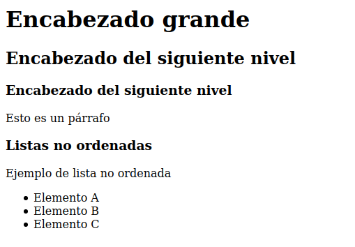

# Examen Parcial: 2021-06-28

* **Tiempo**: 2h 
* **Descripción**: Examen extraordinario de CSAAI
* **Fecha**: 2021/Junio/28
* **Formato**: Presencial. Realizado a través de Aula virtual (sin internet)
* **Puntuación**: Todas las preguntas valen 0.5. Las preguntas incorrectas No restan
* **Temario**: Entra todo lo visto tanto en teoría como en práctica hasta el momento:
  * Teoría: S1-S11
  * Práctica: L1-L12

# Enunciado

## Pregunta 1. HTML y peticiones

El siguiente código HTML está alojado en el fichero index.html en un servidor web. Desde el navegador introducimos la url raiz del servidor y pulsamos enter. A partir de ese momento, indica qué ficheros solicita el navegador al servidor y en qué orden

```html
<!DOCTYPE html>
<html>
<head>
    <meta charset="UTF-8">
    <meta http-equiv="X-UA-Compatible" content="IE=edge">
    <meta name="viewport" content="width=device-width, initial-scale=1.0">
    <title>Mi página web</title>
    <script src="test.js"></script>  
    <link rel="stylesheet" href="style.css">
    <script src="Ej2.js" defer></script>
    <!-- Download: file.pdf 
    -->
</head>
<body>
    <a href="link.html">Link</a>
    
    <p id="image2.jpg">Image 2</p>
    <!-- 
        Load: image3.jpg
     -->
     <p>Image 3</p>
</body>
</html>
```

### Solución

En total se solicituan 5 ficheros, en este orden: 1. index.html, 2. test.js, 3. style.css, 4. Ej2.js y 5.image1.jpg

## Pregunta 2: S1. HTML y estructura

El siguiente árbol representa la estructura en memoria de un documento HTML que no tiene cabeza (sólo tiene cuerpo). Escribe el código HTML que da lugar a esta estructura


### Solución

```html
<!DOCTYPE html>
<html>
    <body>
        <h1>Pregunta 3</h1>
        <div>
            <h2>Mensaje 2</h2>
            <p>Este examen lo apruebo</p>
            <p>¡Vamos!</p>
        </div>
    </body>
</html>
```


## Pregunta 3: S2. HTML

Escribe el código HTML que produce esta salida en el navegador. El documento debe estar completo, pero sin incluir la cabeza. No hay estilo definido, sólo HTML




### Solución

```html
<!DOCTYPE html>
<html>
<body>
    <h1>Encabezado grande</h1>
    <h2>Encabezado del siguiente nivel</h2>
    <h3>Encabezado del siguiente nivel</h3>
    <p>Esto es un párrafo</p>
    <h3>Listas no ordenadas</h3>
    <p>Ejemplo de lista no ordenada</p>
    <ul>
        <li>Elemento A</li>
        <li>Elemento B</li>
        <li>Elemento C</li>
    </ul>
</body>
</html>
```

## Pregunt 4: S2. HTML y elementos

Escribe el **cuerpo** de un documento html en el que haya **3 párrafos** con los textos: párrafo 1, párrafo 2 y párrafo 3. El párrafo 1 está identificado con la cadena "p1". Los párrafos 2 y 3 pertenecen al mismo grupo, identificado como "A". Escribe **sólo el cuerpo**, delimitado por sus etiquetas correspondientes


### Solución

```html
<body>
    <p id="p1">Párrafo 1</p>
    <p class="A">Párrafo 2</p>
    <p class="A">Párrafo 3</p>
</body>
```


## Pregunta 5: S3. Selectores y HTML

Indica dónde podemos colocar los **selectores** para dar estilo a elementos de HTML

### Solución

Los selectores se pueden incluir dentro del propio documento HTML, delimitados por las etiquetas <style></style> o bien en un fichero CSS externo


## Pregunta 6: S3. Reglas de estilo

Dado el siguiente código HTML:

```html
<!DOCTYPE html>
<html>
  <head>
    <meta charset="utf-8">
    <meta http-equiv="X-UA-Compatible" content="IE=edge">
    <meta name="viewport" content="width=device-width, initial-scale=1.0">
    <title>Pregunta 9</title>
    <link rel="stylesheet" href="Ej-02.css">
  </head>

  <body>
    <div>
      <p style="color:red;">P1</p>
      <p id="quien">P2</p>
      <p class="cual">P3</p>
      <p>P4</p>
    </div>
  </body>
</html>
```

Se le aplica la siguiente hoja de estilo:

```css
#quien {
  color: orange;
}

.cual {
  color: green;
}

/* Regla de estilo 1 */
p {
  color: blue;
}

/* Regla de estilo 2 */
div {
  color: yellow;
}

body {
  color: pink;
}
```

Determinar de qué color se renderizarán los textos P1, P2, P3 y P4

### Solución

* P1: Rojo
* P2: Naranja
* P3: Verde
* P4: Azul

## Pregunta 7: S3. Prioridades

Si en la hoja de estilo de la pregunta 6 se eliminan las reglas de estilo 1 y 2 (las indicadas en los comentarios), ¿De qué colo se renderizarán ahora los texot P1, P2, P3 y P4?

### Solución

* P1: Rojo
* P2: Naranja
* P3: Verde
* P4: Rosa


## Pregunta 8. S4. Atributo defer

Explica para qué se usa el atributo defer dentro de la etiqueta `<script>`

### Solución

Cuando se coloca este atributo el programa javascript se empieza a ejecutar una vez que el navegador ha terminado de procesador el fichero html

## Pregunta 9. S4. Acceso a elementos HTML

Dado el siguiente código html:

```html
<!DOCTYPE html>
<html lang="en">
<head>
    <meta charset="UTF-8">
    <meta http-equiv="X-UA-Compatible" content="IE=edge">
    <meta name="viewport" content="width=device-width, initial-scale=1.0">
    <title>Pregunta 15</title>
    <script src="P15.js" defer></script>
</head>
<body>
    <h1>Pregunta 15</h1>
    <h2 class="A"></h2>
    <p class="A"></p>
</body>
</html>
```

Y el siguiente código Javascript:

```js
const d = document.getElementsByClassName("A");

for (let e of d) {
    e.innerHTML="Hola";
}
```

Indica qué texto aparece en la página web

### Solución

Aparecerán tres líneas, con los siguientes textos:

* Pregunta 15
* Hola
* Hola

### Pregunta 10: S4. Javascript

Dada la siguiente página web, formada por los siguientes dos ficheros. Explica qué se muestra inicialmente y qué sucede después

* **Fichero P10.html**:

```html
<!DOCTYPE html>
<html lang="en">
<head>
    <meta charset="UTF-8">
    <meta http-equiv="X-UA-Compatible" content="IE=edge">
    <meta name="viewport" content="width=device-width, initial-scale=1.0">
    <title>Pregunta 10</title>
    <script src="P10.js" defer></script>
</head>
<body>
    <h1 id="a"></h1>
</body>
</html>
```

* **Fichero P10.js**:

```js
const h = document.getElementById('a');

h.innerHTML="0";

let v = 0;

h.onclick = (e) => {
    v = v + 1;
    h.innerHTML += v;
    
}
```

### Solución

Inicialmente se muestra el texto 0  (Este valor '0' se asigna al ejecutarse javascript la primera vez). Cada vez que se haga un click sobre este elemento se añade su número incrementado en uno. Así, si haces 3 clicks veremos la cadena: "0123"


## Pregunta 11: S6. FPS

Un juego programado en Javascript tarda los siguientes tiempos en realizar las siguientes acciones:

* Cálculo de las física del juego: 10ms
* Borrado de la pantalla: 5ms
* Dibujo de los objetos en la pantalla: 5ms

¿Cual será la **frecuencia de refresco** de la pantalla en **fps**?. De acuerdo a ese resultado, indica si el movimiento se verá fluido o no

### Solución

El tiempo que se tarda en tener disponible el nuevo frame será de T = 5 + 5 + 5 = 20ms. Esto nos da ua frecuencia de refresco de 1 / 20ms = 50Hz, que son unos 50 fps.  Como la frecuencia es menor de 50Hz, el movimiento se verá menos fluido

## Pregunta 12: S6. Dibujando

Analiza los iguientes ficheros e Indica qué es lo que aparece en el navegador cuando se carga P12.html:

* P12.html:

```html
<!DOCTYPE html>
<html>
<head>
    <meta charset="UTF-8">
    <script src="P12.js" defer></script>
    <link rel="stylesheet" href="P12.css">
</head>
<body>
    <h2>Canvas</h2>
    <canvas id="canvas"></canvas>
</body>
</html>
```

* P12.css:

```css
canvas {
    background-color: lightblue;
    border-style: solid;
    border-width: 1px;
    border-color: black;
    border-radius: 5px;
  }
```

* P12.js

```js
const canvas = document.getElementById("canvas");
canvas.width = 200;
canvas.height = 100;
const ctx = canvas.getContext("2d");
ctx.beginPath();
  ctx.rect(5,5, 100, 50);
  ctx.fillStyle = 'blue';
  ctx.fill();
  ctx.stroke();
ctx.closePath();
```

### Solución

Aparece un canvas azul claro de dimensiones 200x100, con borde negro y esquinas redondeadas. Dentro de ese canvas, en la posición 5,5 estará la esquina superior izquierda de un rectángulo azul de dimensiones 100x50

## Pregunta 13: S6. Canvas I 

¿Qué se dibuja en un canvas cuando se ejecutan los siguientes métodos de su contexto ctx? (no indiques coordenadas concretas, explícalo en general)

```js
ctx.beginPath();
    ctx.moveTo(10, 20);
    ctx.lineTo(100, 20);
    ctx.moveTo(10, 80);
    ctx.lineTo(150,80);
    ctx.strokeStyle = 'blue';
    ctx.lineWidth = 4;
    ctx.stroke()
ctx.closePath()
```

### Solución

Se dibujan dos líneas horizontales azules, con un grosor de 4 píxeles. La línea inferior es más larga que la superior

## Pregunta 14: S6. Canvas II

En una aplicación web tenemos definido un canvas, que ya está inicializado, y tiene un tamaño de 800x600 píxeles. Su contexto se encuentra en el objeto `ctx`. La variable x está inicializada a 0. En el código javascript, tras todas las inicializaciones, tenemos el siguiente fragmento:

```js
function A() 
{
 
  x = x + 1;
  ctx.clearRect(0, 0, canvas.width, canvas.height);
  ctx.beginPath();
    ctx.rect(x, 10, 20, 20);
    ctx.fillStyle = 'red';
    ctx.fill();
  ctx.closePath();
  requestAnimationFrame(A);
}

A();
```

Explica, de forma general lo que hace este código (NO lo describas línea a línea. Analízalo y resume en un párrafo corto lo que hace)

### Solución

Se realiza la animación de un cuadrado rojo, que se desplaza de izquierda a derecha a la velocidad de 1 pixel por frame. La animación sólo termina si recargamos la página. Cuando el cuadrado sale del canvas, la animación continua pero el objeto ya no se muestra


## Pregunta 15: S7. Botones radio

¿Qué son los botones tipo radio?

### Solución

Son un grupo de botones que sólo pueden estar en dos estdos, pero sólo uno de ellos puede estar activo. Si pulsamos en otro se activa el nuevo y se descativa el anterior

## Pregunta 16: S7. HTML

Dado el siguiente fragmento de código HTML incluido en una aplicación web, ¿Qué es lo que se renderiza en la pantalla?

```html

<p> <span id="c1_test">c1</span> <input type="checkbox" id="checkbox1" > 
    <span id="c2_test">c2</span> <input type="checkbox" id="checkbox2"> </p>

```

### Solución

Se colocan dos botones de verificación en la misma línea, uno al lado del otro, identificados con los nombres "c1" y "c2"


## Pregunta 17: S7. HTML y JS

Tenemos definidos los siguientes ficheros. ¿Qué hace esta aplicación web?

* Fichero: index.html

```html

<!DOCTYPE html>
<html>
<head>
    <meta charset="UTF-8">
    <link rel="stylesheet" href="style.css">
    <script src="test.js" defer></script>
</head>
<body>
    <p>Holi...</p>
</body>
</html>

```

* Fichero: style.css

```css

.A {
    background: lightblue;
  }
  
```

* Fichero: test.js

```js

body = document.getElementsByTagName('body')[0]
window.onkeydown = (e) => {
  if (e.key == 'a') {
    body.classList.toggle("A");
  }
}

```

### Solución

Muestra el texto "Holi" con el fondo por defecto. Cada vez que se aprieta la tecla 'a' cambia el color de fondo


## Pregunta 18: S9. Conversion analógico-digital

Indica las etapas que hay en el proceso de conversión del audio analógico al digital, y explica brevemente, y de forma clara y concisa,cada una de ellas

### Solución

En el proceso de pasar de analógico a digital hay dos fases: El muestreo y la cuantificación. En el primero se obtiene una señal discreta en el tiempo, tomando muestras con periodo T, con precisión infinita. En el segundo estas muestras se representan mediante los bits disponibles, convirtiéndose a números binarios de cierta precisión

## Pregunta 19: S10. Tipos de aplicaciones multimedia

Indica qué tipos de aplicaciones multimedia hay y cuáles son sus requisitos de diseño

### Solución

Las aplicaciones multimedia se dividen en dos grupos: las aplicaciones interactivas y las de streaming. Las primeras son las más restrictivas. En ellas el retardo debe estar comprendido entre 150 y 450ms. En las segundas entre 1 y 10 segundos. No debe haber interrupciones en ningún caso

## Pregunta 20: S10. Tiempo de playout 

 Se tiene una red en la que entre el emisor y el receptor sólo hay un nodo. Los retardos de transmisión son de 0. Se envían dos paquetes de 20ms. El tiempo de encolamiento del paquete 1 es de 2ms. El del paquete 2 de 30ms. ¿Cual es el tiempo de playout mínimo? ¿Qué tiempo de playout usarías si estás implementando una aplicación de streaming?

 ### Solución

 El tiempo de playout mínimo es de 50ms. Sin embargo, a la hora de implementar una aplicación de streaming en esta red se usaría un tiempo de playout de 1 segundo, que es lo mínimo para este tipo de aplicaciones 


